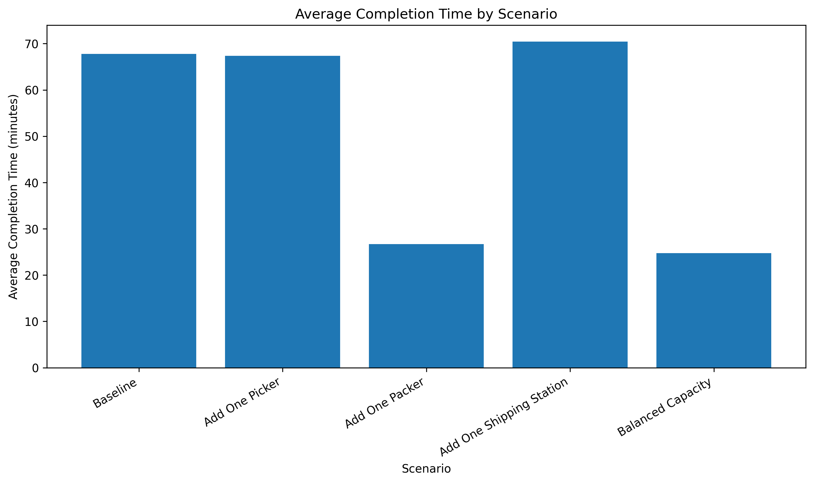
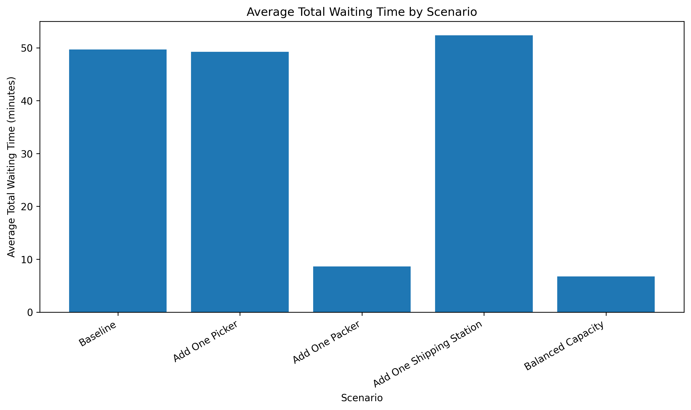
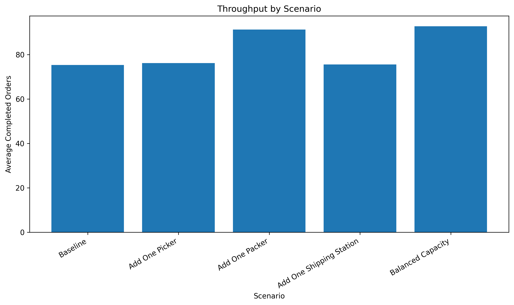
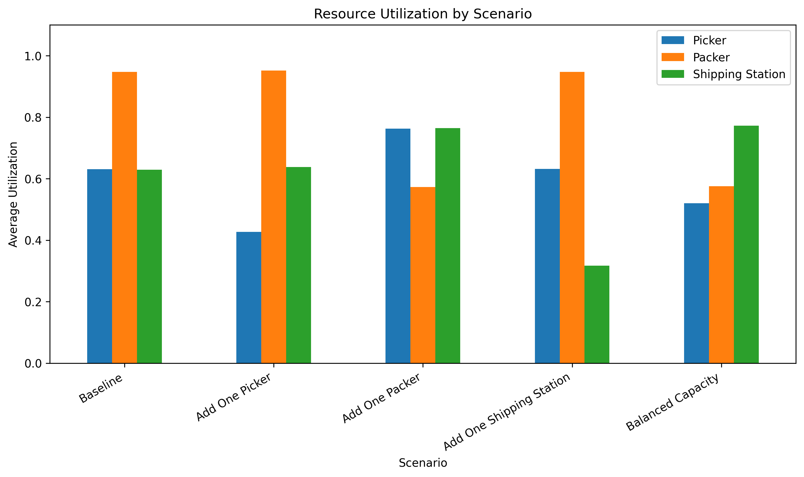
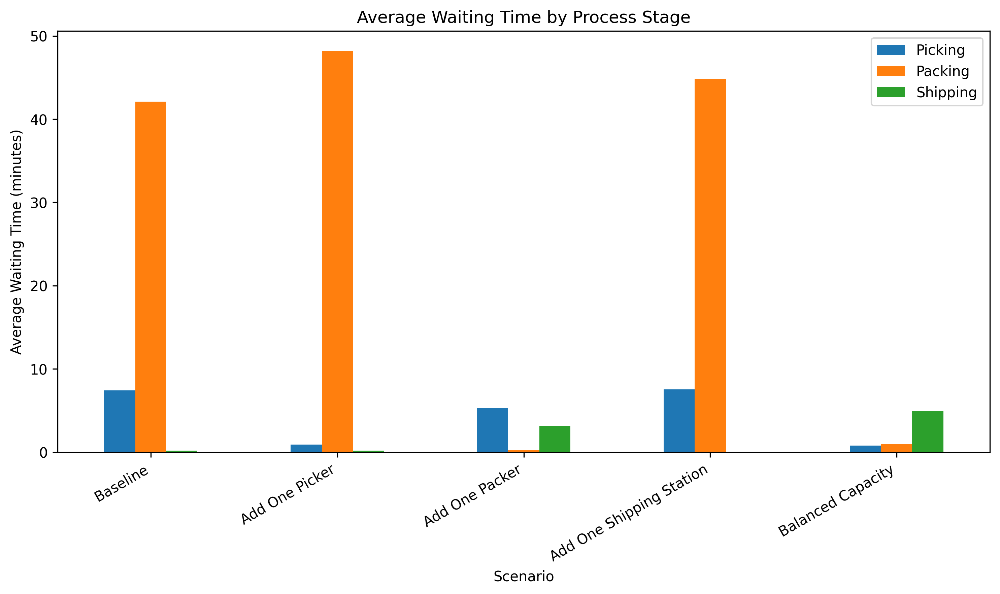
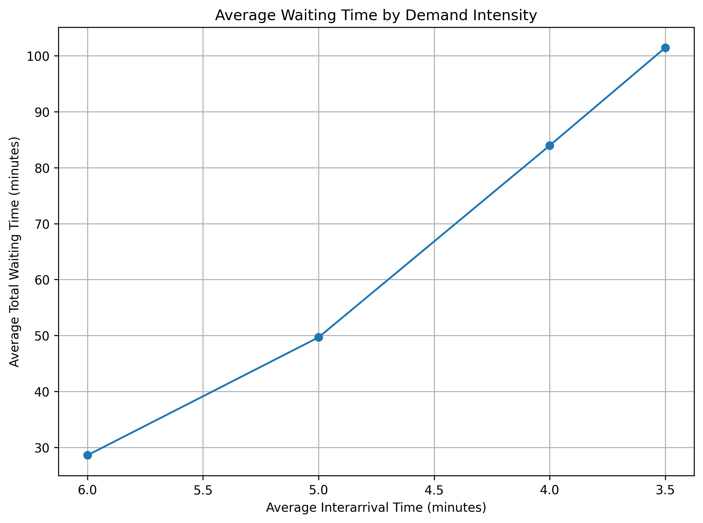
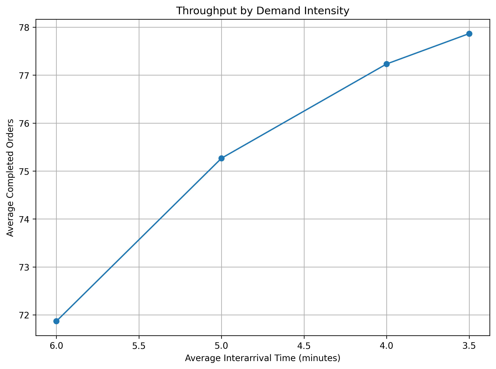

# Simulation-Based Decision Support for Warehouse Operations

## Project Overview

This project develops a discrete-event simulation model for a warehouse order fulfillment system. The simulated warehouse includes order arrivals, picking, packing, and shipping processes.

The goal is to evaluate how different staffing and capacity policies affect waiting time, order completion time, throughput, and resource utilization.

This project is part of my **Operations and Supply Chain Analytics** portfolio and focuses on warehouse operations simulation, bottleneck analysis, and simulation-based decision support.

## Research Question

**How can simulation-based decision support help identify bottlenecks and evaluate operational policies in warehouse order fulfillment systems?**

## System Flow

Orders arrive -> Picking -> Packing -> Shipping -> Order completed

## Scenario Design

The simulation compares five warehouse staffing and capacity scenarios:

| Scenario | Pickers | Packers | Shipping Stations |
|---|---:|---:|---:|
| Baseline | 2 | 1 | 1 |
| Add One Picker | 3 | 1 | 1 |
| Add One Packer | 2 | 2 | 1 |
| Add One Shipping Station | 2 | 1 | 2 |
| Balanced Capacity | 3 | 2 | 1 |

Each scenario was evaluated using 30 simulation replications.

## Key Findings

The baseline warehouse system shows a clear bottleneck at the packing stage. Under the baseline configuration, packer utilization is close to full capacity, and the average waiting time before packing is much higher than the waiting time before picking or shipping.

Adding one picker does not meaningfully improve system performance because picking is not the main constraint. Adding one shipping station also provides little benefit because shipping is not the main bottleneck.

Adding one packer substantially improves system performance by reducing waiting time and order completion time. The balanced capacity scenario achieves the strongest overall performance among the tested policies.

## Key Results

### Average Completion Time by Scenario

### Average Total Waiting Time by Scenario

### Throughput by Scenario

### Resource Utilization by Scenario

### Waiting Time by Process Stage

## Sensitivity Analysis

A demand intensity sensitivity analysis was conducted by changing the average interarrival time while keeping the baseline resource configuration fixed.

The results show that as orders arrive more frequently, average waiting time increases sharply and packer utilization remains close to full capacity. This suggests that the packing bottleneck becomes more severe under higher demand intensity.

### Average Waiting Time by Demand Intensity

### Throughput by Demand Intensity

## Report

[Download the final report](assets/final_report.pdf)

## Tools

- Python
- SimPy
- pandas
- numpy
- matplotlib
- Jupyter Notebook

## Conclusion

This project demonstrates how discrete-event simulation can support bottleneck analysis, capacity planning, and resource allocation decisions in warehouse operations.

The simulation results show that the baseline system is mainly constrained by the packing stage. Adding packing capacity is more effective than adding picking or shipping capacity, and balanced resource allocation produces the strongest overall system performance.